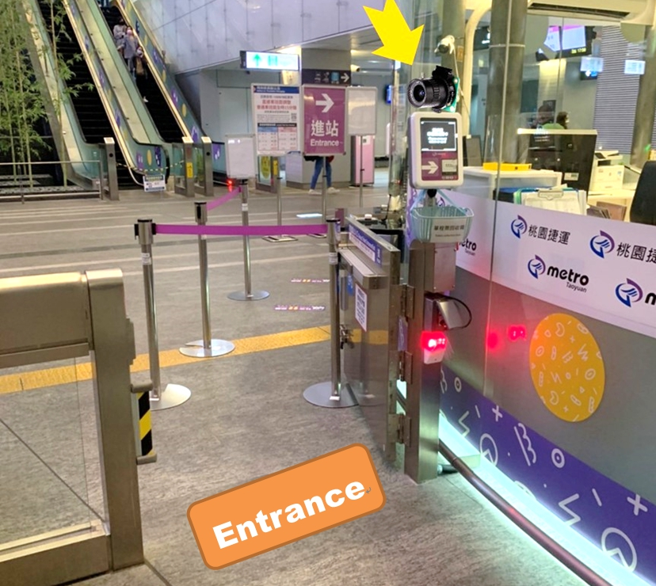
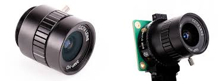
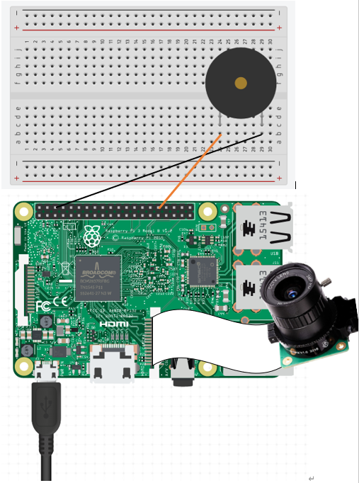

# Face-Recognition-using-Raspberry-Pi
for homework
## 1. 關於專案
將鏡頭放在閘門入口，透過人臉辨識確認是否為已存取之人員，若確認為已存取人員將發出Do-re-me暗示可以通過，若辨識非存取人員則發出警告聲響，且拍照存取入侵者。

## 2. 專案緣由
機場捷運近兩年來不斷推陳出新，引領軌道業先驅新增信用卡及行動支付感應支付，作為國家門面希望推出更加智慧化的人臉辨識功能，帶領台灣進步。

## 3. 專案構想
人臉辨識因涉及隱私權，僅提供定期票購買旅客使用，可供旅客30、60、90、120日內搭乘使用，此方式可避免旅客定期票遺失、刷錯卡、一票多人共用等情形。

支付定期費用的旅客使用相機拍照後，將照片存取在資料庫中，當旅客欲搭乘捷運於出入口感應人臉，透過人臉辨識確認是否為已存取人員，若為存取人員則透過蜂鳴器發出do-re-me聲響，若非存取人員則發出告警聲響，並拍照存取入侵者頭像，可公布在車站避免旅客違規闖入。

## 4. 專案所需實體材料
* 一個Rasberry Pi 3
* 一個Raspberry Pi 樹莓派UPS 鋰電池擴充板USB 電源供應模組行動電源
* 一顆鏡頭
* 麵包板實驗板
* 兩條公對母杜邦線 (目的:連接Rasberry Pi與蜂鳴器)
* 蜂鳴器
* 筆電
## 5. 材料細節
* 鏡頭

* 蜂鳴器

## 6. 線路設計,指令表與實體照片

## 7. 程式設計
## 8. 影片呈現連結
https://youtu.be/Sn16_KW4zAc
## 9. 可以改進或其他發想
## 10.參考資料
https://github.com/kunalyelne/Face-Recognition-using-Raspberry-Pi
